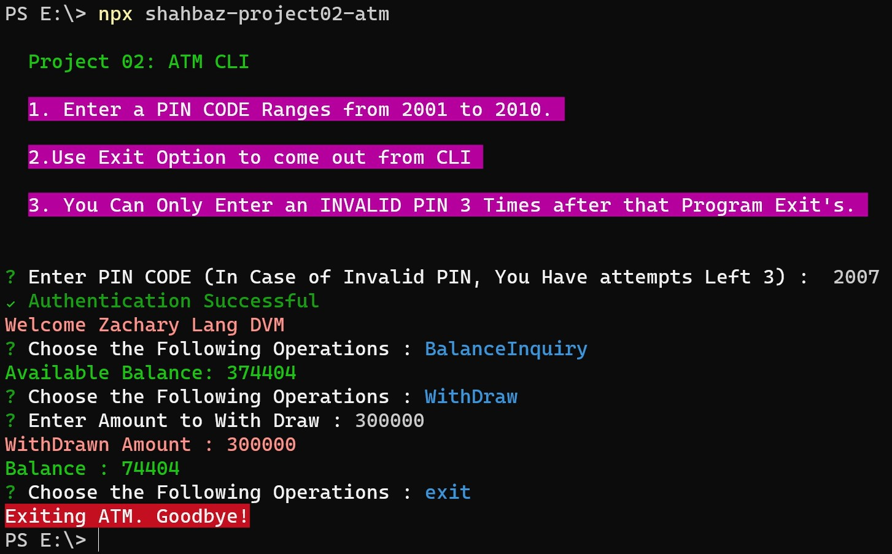

# ATM CLI

- This is a CLI Based ATM Machine.
- User will Add an PIN CODE Ranges From 2001 to 2010.
- In Case of Entering Invalid PIN CODE 3 times, Program will automatically exit's.
- This CLI is Deployed on NPM as an <a href="https://www.npmjs.com/package/shahbaz-project02-atm">Pacage</a>.

<br>

## Install

```sh
# Install globally (recommended).
npm install -g shahbaz-project02-atm

# Or run directly with npx (installs CLI on every run).
npx shahbaz-project02-atm
```

<br>

## Screen Shot

<h4 align="center">
        
    </a>
    <br>
    <br>
</h4>
