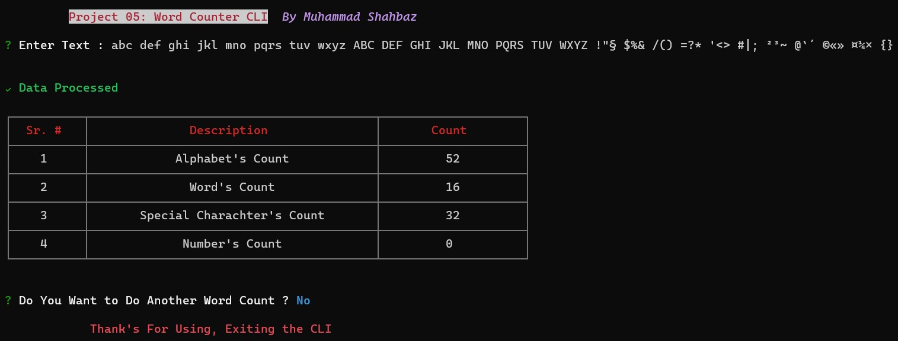

# Word Counter CLI

_The Word Counter CLI (Built Using *TypeScript & Node.js*) is a command-line tool that allows users to input text and provides various statistics related to the input. It counts alphabetic characters, words, special characters, and numeric characters._

## Install

```sh
  # Install globally (recommended to avoid installation again & again).
  npm install -g shahbaz-project05-word-counter

  #run directly with npx (installs CLI on every run)
  npx shahbaz-project05-word-counter
```

## Features

The application provides the following features:

- Counts alphabetic characters (a-z & A-Z)
- Calculates word count (excluding whitespaces)
- Identifies Special Characters (e.g., &, \*, $, [], \_, +, etc.)
- Tracks Numeric characters.
- Display Result in a User Friendly manner using Table.

## Preview

  <h4 align="center"> 
    
    <br>
    <br>
  </h4>

## Deployment

This CLI is deployed as <a href="https://www.npmjs.com/package/shahbaz-project05-word-counter">Pacage</a> on Node Pacage Manager

## Dependencies

The application uses the following Dependencies:

- @types/inquirer ^9.0.7
- chalk ^5.3.0
- cli-table3 ^0.6.3
- ora: ^8.0.1
- inquirer ^9.2.12
