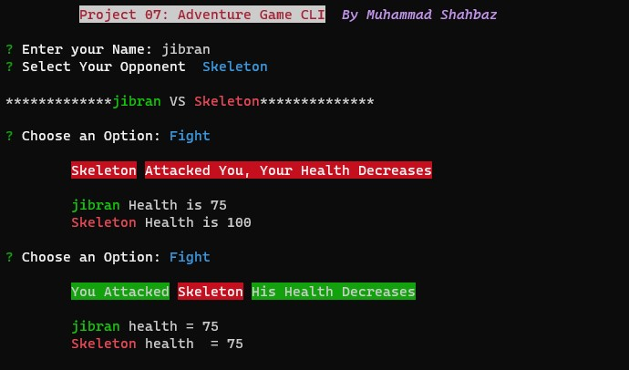

# Adventur Game CLI

_The Adventure Game CLI (Built Using TypeScript & Node.js) is a command-line game where players can engage in battles with various opponents. Players can choose their character and fight against opponents like Skeletons, Assassins, and Zombies_

## Install

```sh
  # Install globally (recommended to avoid installation again & again).
  npm i shahbaz-project07-adventure-game

  #run directly with npx (installs CLI on every run)
  npx shahbaz-project07-adventure-game
```

## Features

The Adventure Game CLI offers the following features:

- Choose your character and opponent
- Engage in battles with opponents
- Fight, drink health potions, or run for your life during battles
- Keep track of health points for both player and opponent
- Continue battling until victory or defeat

## Preview

  <h4 align="center"> 
    
    <br>
    <br>
  </h4>

## Deployment

This CLI is deployed as <a href="https://www.npmjs.com/package/shahbaz-project07-adventure-game">Pacage</a> on Node Pacage Manager

## Dependencies

The application uses the following Dependencies:

- @types/inquirer ^9.0.7
- chalk ^5.3.0
- inquirer ^9.2.12
