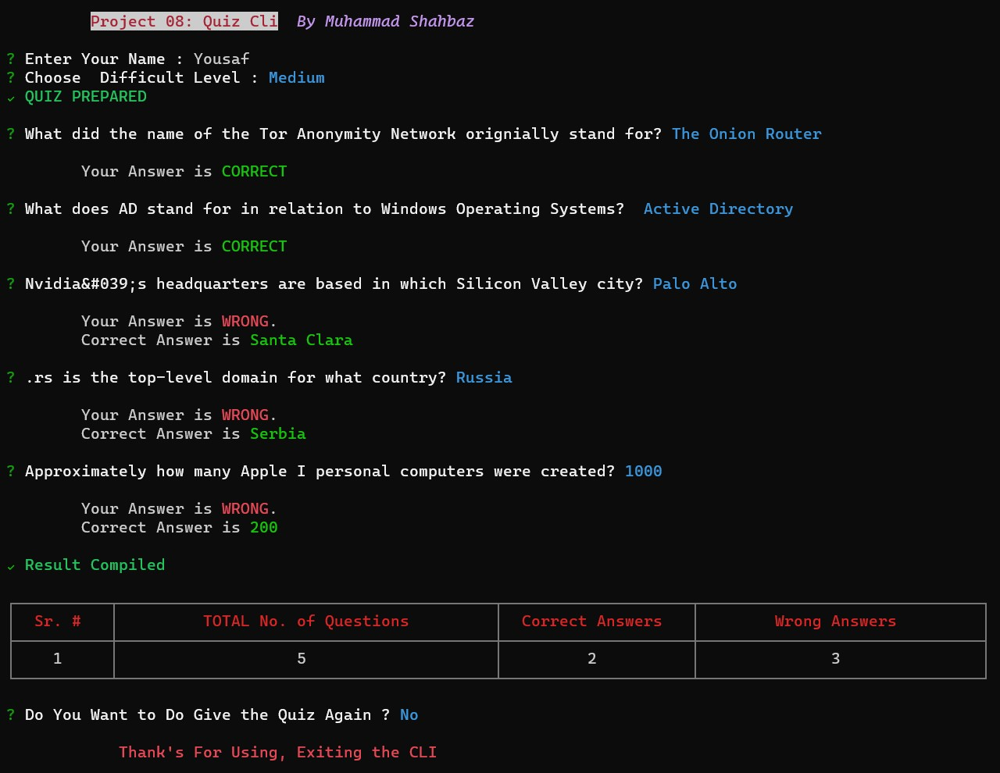

# QUIZ CLI

_This is a Command-line Based Quiz Application that allows users to test their knowledge in Computer Science Feild. The App fetches quiz questions from an external API and presents them to the user. After answering the questions, the user receives a score & feedback._

## Install

```sh
  # Install globally (recommended to avoid installation again & again).
  npm i shahbaz-project08-quiz

  #run directly with npx (installs CLI on every run)
  npx shahbaz-project08-quiz
```

## Features

The Adventure Game CLI offers the following features:

- Choose the difficulty level (Easy, Medium, Hard).
- Fetch Quiz questions from the API.
- Display questions one by one.
- Calculate the user’s score.
- Provide feedback on incorrect answers.
- Display Quiz Result in a Table.

## Preview

  <h4 align="center"> 
    
    <br>
    <br>
  </h4>

## Deployment

This CLI is deployed as <a href="https://www.npmjs.com/package/shahbaz-project08-quiz">Pacage</a> on Node Pacage Manager

## Technologies Used

- Node.js
- TypeScript
- _Open Trivia DB_ (Used as API for getting Quiz Question/Answer.)
- Inquirer (for user input)
- Chalk (for colorful console output)
- Ora (for loading spinner)
- Cli-table3 (For Displaying Table)

## Dependencies

The application uses the following Dependencies:

- @types/inquirer ^9.0.7
- chalk ^5.3.0
- inquirer ^9.2.12
- ora ^8.0.1
- cli-table3 ^0.6.3
-
