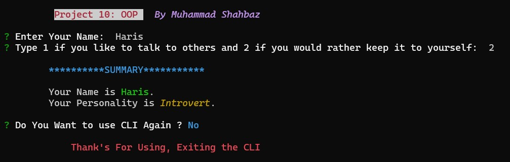

# COUNTDOWN TIMER CLI

_This Project is an Interactive Command-Line Interface (CLI) application that is developed using OOP(Object Oriented Programming) Concept's(Classes, Object, Inheritance, e.t.c) in TypeScript Language._

## Install

```sh
  # Install globally (recommended to avoid installation again & again).
  npm i

  #run directly with npx (installs CLI on every run)
  npx
```

## OOP Concepts

This project effectively demonstrates several OOP principles such as **encapsulation, abstraction, and instantiation**. It encapsulates the behavior of a student within the Student class, abstracting away the details of how it operates. Additionally, it instantiates objects from this class to represent individual students, allowing for modular and reusable code

## Features

This CLI offers the following features:

- **Input Prompt:** Asks the user to enter their name and a number
  indicating their preference for interaction.
- **Object Creation:** Utilizes the Student class to create a student
  object and interact with it.
- **Summary** Display: Presents a summary of the interaction including the
  entered name and the personality based on the interaction preference.

## Preview

  <h4 align="center"> 
    
    <br>
    <br>
  </h4>

## Deployment

This CLI is deployed as <a href="https://www.npmjs.com/package">Pacage</a> on Node Pacage Manager

## Technologies Used

- Node.js
- TypeScript
- Inquirer (for user input)
- Chalk (for colorful console output)

## Dependencies

The application uses the following Dependencies:

- @types/inquirer ^9.0.7
- chalk ^5.3.0
- inquirer ^9.2.15
