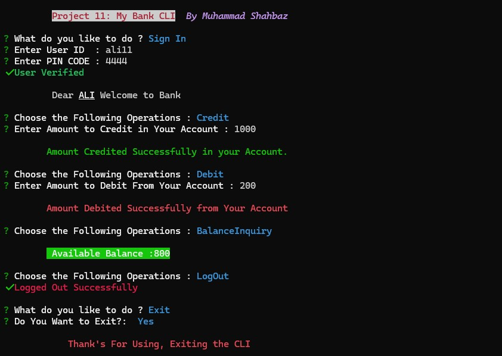

# QUIZ CLI

_This is a Command-line Based Bank Application,It provides a simple yet powerful command-line interface for managing bank accounts, allowing users to perform actions such as creating new accounts, logging in, making debit/credit transactions, and checking their account balance.._

## Install

```sh
  # Install globally (recommended to avoid installation again & again).
  npm i shahbaz-project11-oop-mybank

  #run directly with npx (installs CLI on every run)
  npx shahbaz-project11-oop-mybank
```

## Features

The Bank CLI offers the following features:

- New Account Creation.
- User Login.
- Debit / Credit Feature.
- Balance Inquiry.

## Preview

  <h4 align="center"> 
    
    <br>
    <br>
  </h4>

## Deployment

This CLI is deployed as <a href="https://www.npmjs.com/package/shahbaz-project11-oop-mybank">Pacage</a> on Node Pacage Manager

## Technologies Used

- Node.js
- TypeScript
- Inquirer (for user input)
- Chalk (for colorful console output)
- Ora (for loading spinner)

## Dependencies

The application uses the following Dependencies:

- @types/inquirer ^9.0.7
- chalk ^5.3.0
- inquirer ^9.2.16
- ora ^8.0.1
